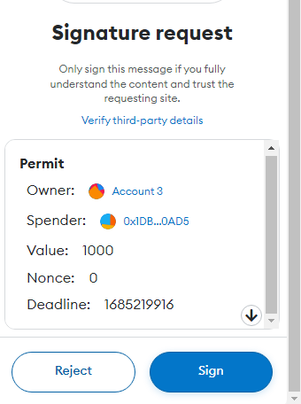
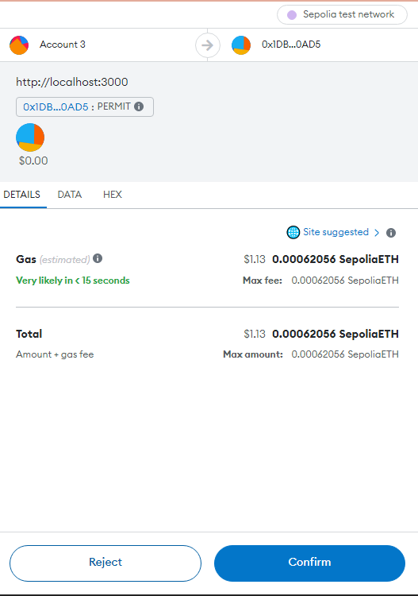

# ERC20 Permit 

This project is to test the ERC20 Permit Functionalities
## <a href="https://permit-ui.onrender.com/"> Deployed Site</a>

To start the project 

```
 npm start
```
Project is configured to work in Sepolia Network
Configuration are hardcoded in 
`AppChainId` and `RCP_URL` in `general-utils.js`

## Sign


## Permit transaction


